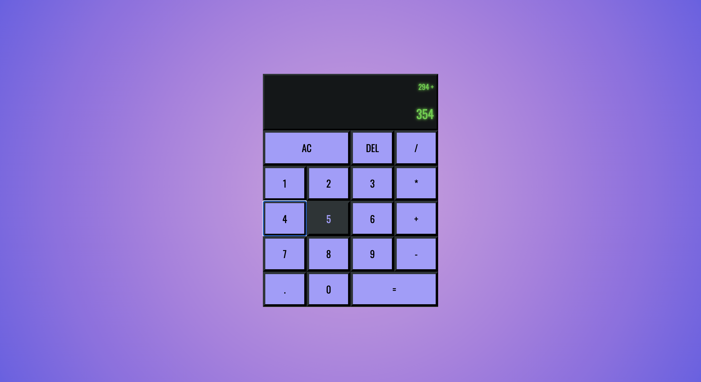
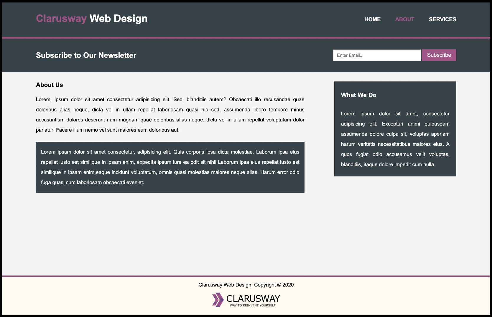
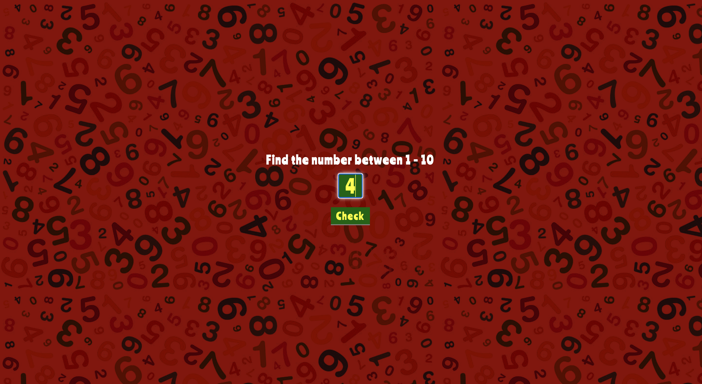
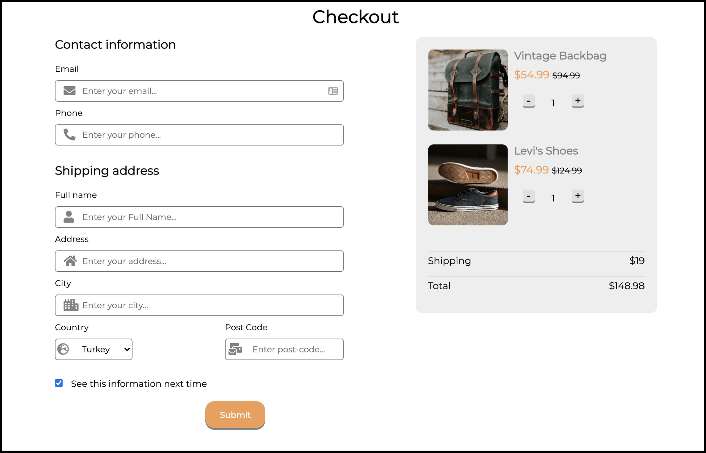
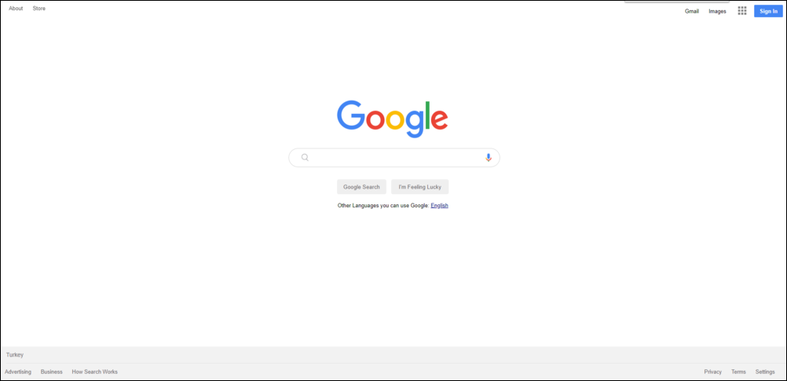
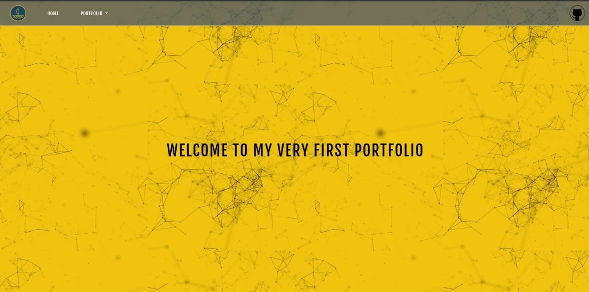

# Index

### Projects

- **SD_02_Filterable Restaurant Menu (HTML, CSS, JS)**  [Repository](https://github.com/SemihDurmus/SD_02_Filterable_Restaurant_Menu) - 
  [web view](https://semihdurmus.github.io/SD_02_Filterable_Restaurant_Menu/) 
  <video width="400" height="300" controls>
  <source src="menu.mov" type="video/mp4">
  </video>
      
- **JS_02_Calculator (HTML, CSS, JS)**  [Repository](https://github.com/SemihDurmus/JS_02_Calculator.git) - 
  [web view](https://semihdurmus.github.io/JS_02_Calculator/) 
      
- **HC_04_Website Page Design(HTML, SASS-Responsive, JS)**  [Repository](https://github.com/SemihDurmus/HC_04_Website_Page_Design) - [web view](https://semihdurmus.github.io/HC_04_Website_Page_Design/) 
   
   
      
- **JS_01_Find the Number Game(HTML, CSS-Responsive, JS)**  [Repository](https://github.com/SemihDurmus/JS_01_Find_the_Number) - 
  [web view](https://semihdurmus.github.io/JS_01_Find_the_Number/)  
      
- **Sprint_1_Crew Page (HTML, CSS-Responsive)**  [Repository](https://github.com/SemihDurmus/1_Sprint_Crew_Page) - 
  [web view](https://semihdurmus.github.io/Sprint_1_Crew_Page/)  
      
- **HC_03_Parallax Website (HTML, SASS-Responsive)**  [Repository](https://github.com/SemihDurmus/HC_03_Parallax_Website) - [web view](https://semihdurmus.github.io/HC_03_Parallax_Website/) 
      
- **CC_03_Checkout Form (HTML, CSS-Responsive)**  [Repository](https://github.com/SemihDurmus/CC_03_Checkout_Form) - [web view](https://semihdurmus.github.io/CC_03_Checkout_Form/) 
      
- **Sprint_2_Digital Clock (HTML, CSS-Responsive, JS)**  [Repository](https://github.com/SemihDurmus/Sprint_2_Digital_Clock.git) - 
  [web view](https://semihdurmus.github.io/Sprint_2_Digital_Clock/)  
   
      
- **HC_02_Google Landing Page (HTML, CSS)**  [Repository](https://github.com/SemihDurmus/HC_02_Google_Landing_Page.git) - [web view](https://semihdurmus.github.io/HC_02_Google_Landing_Page/) 
       
- **SD_01_Best Club (HTML, SASS-Responsive)**  [Repository](https://github.com/SemihDurmus/SD_01_Best_Club_SASS) - [web view](https://semihdurmus.github.io/SD_01_Best_Club_SASS/) 
      
- **HC_01_Netflix Survey Form (HTML, CSS)**  [Repository](https://github.com/SemihDurmus/HC_01_Netflix_Survey_Form.git) - 
  [web view](https://semihdurmus.github.io/Project_HC_01_Netflix_Survey_Form/)  
      
- **Early Portfolio (HTML, CSS, JS)**  [Repository](https://github.com/SemihDurmus/WebSite_Basic_Practices_HTML_CSS_JS.git) - 
  [web view](https://semihdurmus.github.io/WebSite_Basic_Practices_HTML_CSS_JS/)  
      
   
